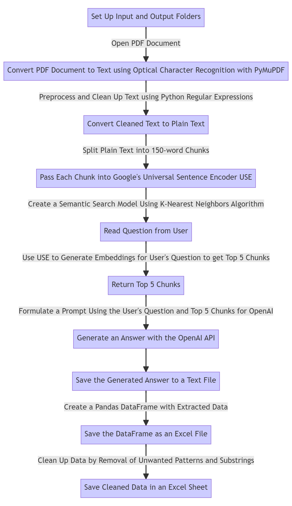

# PDF Data Extractor

The PDF Report Data Extractor is a Python application that enables you to extract specific data from PDFs. It processes multiple PDF files located in an input folder, generates answers for user-defined questions using the OpenAI GPT model, and saves the extracted information in an Excel spreadsheet in the output folder.

## Features

- Extracts specific data from PDF files
- Supports batch processing of multiple PDF files
- Utilizes the OpenAI GPT model for generating answers
- Saves the extracted information in an Excel spreadsheet
- User-friendly GUI for selecting input and output folders, providing question and instruction inputs, and initiating the process

## Prerequisites

Before running the application, ensure that you have the following prerequisites:

- Python 3.10 or later installed on your system
- Required Python packages installed (specified in `requirements.txt`)
- An OpenAI API key for utilizing the OpenAI GPT model (get your key at [OpenAI Platform](https://platform.openai.com/account/api-keys))

## Installation

You have two options for installing and using the PDF Data Extractor:

### Option 1: Running the Python Application

1. Clone the repository or download the source code.

2. Navigate to the project directory using the command line.

3. Create and activate a virtual environment (optional but recommended).

4. Install the required dependencies by running the following command: `pip install -r requirements.txt`

### Option 2: Using the Executable File

1. Download the executable file from [PDF Extractor](https://rebrand.ly/5sxu4rn) (680 MB).

2. Run the executable file to install the application.

## Usage

1. Launch the application by running the `main_app.py` file:

2. The application GUI will appear.

3. Click the "Browse Input Folder" button to select the folder containing the PDF files to analyze.

4. Click the "Browse Output Folder" button to choose the folder where the final Excel file will be saved.

5. Enter your OpenAI API key in the provided field. This key is necessary for generating answers using the OpenAI GPT model.

6. Enter a specific question related to the data you want to extract from the PDF reports.

7. Optionally, provide instructions for how the GPT model should process and structure the answer based on the PDF content.

8. Click the "Process Files" button to start the extraction process. The application will process the PDF files, generate answers for the specified question, and save the extracted information in the output folder as an Excel spreadsheet.

9. Monitor the progress of the processing through the displayed status label.

10. Once the processing is complete, a success message will be displayed, indicating that the Excel file has been generated.

## Workflow

## Contributing

Contributions to the PDF Report Data Extractor project are welcome! If you find any issues or have suggestions for improvement, please feel free to submit a pull request or open an issue on GitHub.

## License

This project is licensed under the [MIT License](LICENSE).
